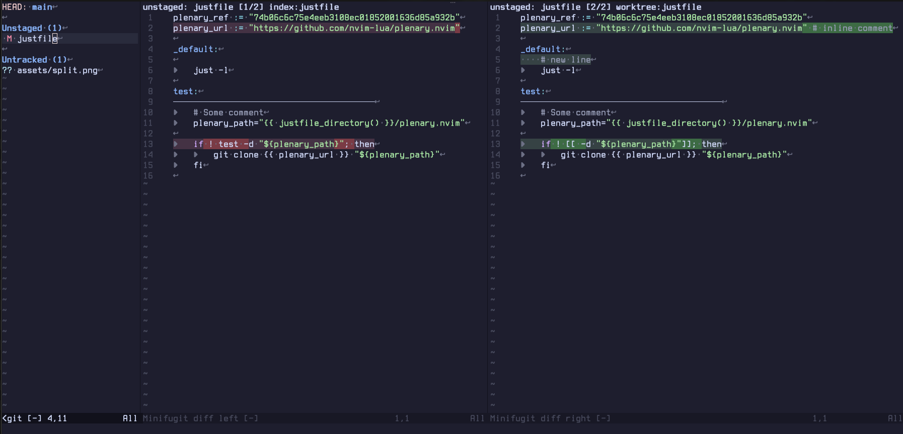
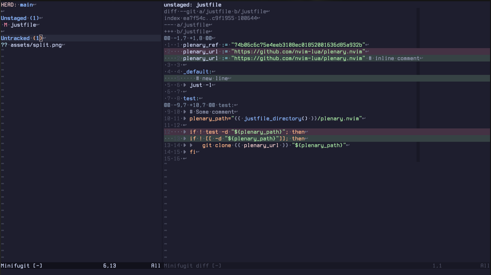

# minifugit.nvim




A lightweight Git status UI for Neovim, inspired by
[vim-fugitive](https://github.com/tpope/vim-fugitive).

minifugit.nvim focuses on a compact status window for everyday Git operations
without leaving Neovim.

## Features

- Open a Git status window with `:MinifugitStatus`.
- View your files' status.
- Discard unstaged changes or delete untracked paths, with confirmation by
  default.
- Stage and unstage files from the status window (visual mode as well).
- Preview diffs for the entry under the cursor in stacked or split view.
- Stage and unstage hunks from the diff window.
- Create commits.
- Animated loading spinner while pushing your commits.
- View unpushed commits in the status window and preview the diffs.
- Run `:checkhealth minifugit` to verify Neovim and Git requirements.

## Requirements

- Neovim 0.10+
- `git` executable on `PATH`

## Configuration

### vim.pack

```lua
vim.pack.add({
    'https://github.com/vieitesss/minifugit.nvim',
    version = vim.version.range("*") -- stable version
    -- version = "nightly"
})
```

### lazy.nvim

```lua
{
    'vieitesss/minifugit.nvim',
}
```

### Options

minifugit works without setup. Configure it with `vim.g.minifugit` before the
plugin loads:

```lua
vim.g.minifugit = {
    preview = {
        -- Start diff previews with wrapping disabled.
        wrap = false,

        -- Show old/new line numbers in diff previews.
        show_line_numbers = true,

        -- Show git diff metadata rows such as `diff --git`, `index`, `---`,
        -- and `+++`.
        show_metadata = true,

        -- Diff preview layout: 'stacked', 'split', or 'auto'.
        diff_layout = 'stacked',

        -- Editor width where 'auto' switches from stacked to split.
        diff_auto_threshold = 120,
    },
    status = {
        -- Fraction of the editor width used by the status window.
        width = 0.4,

        -- Minimum status window width in columns.
        min_width = 20,

        -- Open the minifugit workflow in a dedicated tab.
        open_in_tab = false,
    },
}
```

Or use `setup()` if your plugin manager expects Lua options:

```lua
require('minifugit').setup({
    preview = {
        diff_layout = 'auto',
    },
})
```

Diff-preview mappings can toggle `preview.wrap`, `preview.show_line_numbers`,
`preview.show_metadata`, and the diff layout at runtime for the current status
session.

## Usage

Open the status window:

```vim
:MinifugitStatus
```

```lua
require('minifugit').status()
```

Default status-window mappings:

| Mode | Key | Action |
| --- | --- | --- |
| n | `<CR>` / `o` | Open the file or commit under the cursor |
| n | `=` | Preview the diff for the entry under the cursor |
| n | `q` | Close the status window |
| n | `/` | Filter entries by path or summary |
| n | `<BS>` | Clear the active filter |
| n | `r` | Refresh Git status data |
| n | `s` | Stage entry, or unstage it if already staged |
| v | `s` | Stage the selected entries |
| n,v | `u` | Unstage the entry or selected entries |
| n | `S` | Stage all visible entries |
| n | `U` | Unstage all visible entries |
| n | `d` | Discard the entry with confirmation |
| n | `D` | Discard the entry without confirmation |
| n | `c` | Commit staged changes |
| n | `p` | Push unpushed commits |
| n | `aw` | Alternate diff preview line wrapping |
| n | `an` | Alternate diff preview line numbers |
| n | `am` | Alternate stacked diff preview metadata rows |
| n | `al` | Alternate diff preview stacked/split layout |
| n | `?` | Toggle mappings help |

Default diff-preview mappings:

| Mode | Key | Action |
| --- | --- | --- |
| n | `q` | Close the diff preview |
| n | `<CR>` | Open the file at the diff line under the cursor |
| n | `[h` / `]h` | Jump to the previous/next hunk |
| n | `s` | Stage the hunk under the cursor |
| n | `u` | Unstage the hunk under the cursor |
| n | `d` | Discard the hunk under the cursor with confirmation |
| n | `aw` | Alternate line wrapping |
| n | `an` | Alternate line numbers |
| n | `am` | Alternate metadata rows *(stacked only)* |
| n | `al` | Alternate stacked/split layout |
| n | `?` | Toggle mappings help |
